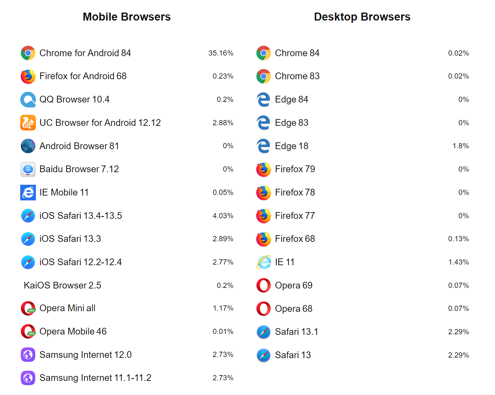

# 开始

## 安装

```bash
$ npm i -D browserslist

+ browserslist@4.14.0
added 5 packages from 5 contributors and audited 5 packages in 4.192s
```

## 查看默认列表

```bash
$ npx browserslist

and_chr 84
and_ff 68        
and_qq 10.4      
and_uc 12.12     
android 81       
baidu 7.12       
chrome 84        
chrome 83        
edge 84
edge 83
edge 18
firefox 79       
firefox 78       
firefox 77       
firefox 68       
ie 11
ios_saf 13.4-13.5
ios_saf 13.3     
ios_saf 12.2-12.4
kaios 2.5
op_mini all
op_mob 46
opera 69
opera 68
safari 13.1
safari 13
samsung 12.0
samsung 11.1-11.2
```

也就是下面这些浏览器：

> 这些名称背后对应的浏览器可以 [在这里看到](https://www.npmjs.com/package/browserslist#browsers)。



> 取自 https://browsersl.ist/ 网站的查询结果。

Browserslist 使用的默认查询条件是 [`> 0.5%, last 2 versions, Firefox ESR, not dead`](https://www.npmjs.com/package/browserslist#full-list)。

## 查看覆盖率

package.json

```json
{
    "scripts": {
        "browserslist": "browserslist \"> 0.5%, last 2 versions, ie >=9\"",
        "browserslist:coverage": "browserslist --coverage \"> 0.5%, last 2 versions, ie >=9\""
    },
}
```


查询覆盖率：

```bash
$ npm run browserslist:coverage

These browsers account for 90.13% of all users globally
```

查询浏览器列表：

```bash
$ npm run browserslist

and_chr 84
and_ff 68        
and_qq 10.4      
and_uc 12.12     
android 81       
baidu 7.12       
bb 10
bb 7
chrome 84        
chrome 83        
edge 84
edge 83
edge 18
firefox 79       
firefox 78       
firefox 77       
ie 11
ie 10
ie 9
ie_mob 11        
ie_mob 10        
ios_saf 13.4-13.5
ios_saf 13.3     
ios_saf 12.2-12.4
kaios 2.5        
op_mini all      
op_mob 46        
op_mob 12.1      
opera 69
opera 68
safari 13.1      
safari 13        
samsung 12.0     
samsung 11.1-11.2
```

(完)
